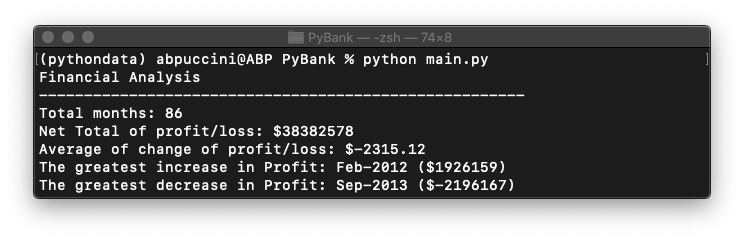

# Py Me UP, Charlie.

Python will be a great option for an analysis of a large data. PyBank and PyPoll are the examples how to applying Python scripting skills into analysis.

## PyBank

### Background

Creating Python script for analysis the financial records of the company. The analysis will contain the calculation of following:

- The total number of months included in the dataset
- The net total amount of "Profit/Losses" over the entire period
- The average of the changes in "Profit/Losses" over the entire period
- The greatest increase in profits (date and amount) over the entire period
- The greatest decrease in losses (date and amount) over the entire period

### Datafile

***PyBank*** >> [Click here to view file](Resources/PyBank_budget_data.csv)

### Python Script and Ananlysis

**Part I: Implementing Modules and defining file path**

    import csv
    import os

    # File path

    data_filepath = os.path.join('Resources', 'budget_data.csv')
    output_filepath = os.path.join('Analysis', 'output.csv')
    analysis_filepath = os.path.join('Analysis', 'PyBank-analysis.txt')

**Part II: Reading file, Storing header and Initializing sets**

    headers = []                                        # set of data header
    rows = []                                           # set of data 
    period = []                                         # set of period
    pl_list =[]                                         # set of profit/losses
    delta_list = []                                     # set of changes of profit/losses 

    with open(data_filepath, 'r') as csvfile:
        csvreader = csv.reader(csvfile, delimiter=',')  
        headers = next(csvreader)                       # Header stored
        for row in csvreader:                           
            rows.append(row)                            # List of data in original file
        for data in rows:                               # Each data in rows is a subset
            momth_index = 0                             # Index of months in data is [0]
            pl_index = 1                                # Index of profit/losses in data is [1]
            period.append(data[momth_index])            # List of periods
            pl_list.append(int(data[pl_index]))         # List of profit/losses
        for x in range(len(pl_list)):                   # x represents index of data in pl_list
            if x == 0:
                delta = 0                               # Index[0] has no comparison to calculate differences
            else:
                delta = pl_list[x] - pl_list[x-1]       # delta is profit/losses differences between period x and x-1
            delta_list.append(int(delta))               # List of changes in profit/losses
        
**Part III: The total number of months included in the dataset**

    month = len(period)                       
        
**Part IV: The net total amount of "Profit/Losses" over the entire period**

    total = sum(pl_list)                        

**Part V: The average of the changes in "Profit/Losses" over the entire period**        
     
    delta_sum = sum(delta_list)
    delta_no = len(delta_list) - 1                      # Number of data in delta_list which is not included index[0] 
    diff_avg = round(float(delta_sum / delta_no), 2)

**Part VI: The greatest increase in profits (date and amount) over the entire period**

    Max = max(delta_list)
    max_period = period[delta_list.index(Max)]

**Part VII: The greatest decrease in losses (date and amount) over the entire period** 

    Min = min(delta_list)
    min_period = period[delta_list.index(Min)]

**Part VIII: Storing additional data into CSV file**

    output = zip(period, pl_list, delta_list)
    output_headers = headers + ['Diff']

    with open(output_filepath, 'w') as datafile:
        writer = csv.writer(datafile)
        writer.writerow(output_headers)
        writer.writerows(output)

**Part IX: Analysis Result, Print to Terminal and Exporting result to txt.file**

- **Analysis Result Python Script**

        result = [
            'Financial Analysis ',
            '------------------------------------------------------',
            f'Total months: {month}',
            f'Net Total of profit/loss: ${total}',
            f'Average of change of profit/loss: ${diff_avg}',
            f'The greatest increase in Profit: {max_period} (${Max})',
            f'The greatest decrease in Profit: {min_period} (${Min})'
        ]

        with open(analysis_filepath, 'w') as txtfile:
            for r in result:                                # r represents each element in result list
                print(r)                                    # print to terminal
                txtfile.write(str(r) + '\n')                # write to .txt file

- **Result printed in Terminal and text File**

    - **Terminal**

    

    - **Text File**

    
---

## PyPoll

### Background

Creating Python script for analysis the poll data. The analysis of votes will contain the calculation of following:

- The total number of votes cast
- A complete list of candidates who received votes
- The percentage of votes each candidate won
- The total number of votes each candidate won
- The winner of the election based on popular vote.

### Datafile

***PyPoll*** >> [Click here to view file](Resources/PyPoll_election_data.csv)

### Python Script and Ananlysis

**Part I: Implementing modules and Analysis**

    import csv
    import os

    # File path

    data_filepath = os.path.join('Resources', 'election_data.csv')
    analysis_filepath = os.path.join('Analysis', 'PyPoll-analysis.txt')

**Part II: Reading file, Storing header and Initializing sets**

    candidate_votes = {}                                        # Dictionary {Candidate: Votes}
    election_votes = []                                         # List of all votes
    candidate_name = []                                         # List of election_votes names               
    percent_votes = []                                          # List of percentage votes for each election_votes
    chart = []

    with open(data_filepath, 'r') as csvfile:
        csvreader = csv.reader(csvfile, delimiter=',')  
        header = next(csvreader)                                # Header stored
        for rows in csvreader:
            name_index = 2                                      # Index of names in rows is [2]
            name = rows[name_index]
            election_votes.append(name)                         # Adding name to the list
        for n in election_votes:                                # n represents each element in election_votes list
            if n not in candidate_name:                         # Removing duplicated election_votes names
                candidate_name.append(n)                        # List of candidates

**Part III: Total votes**

    for i in candidate_name:                                    # i represents each element in candidate_name list 
        candidate_votes[i] = election_votes.count(i)            # Adding key and value into candidate_vote dictionary

    total = sum(candidate_votes.values())                       # Sum of all values in dictionary

**Part IV: Number and Percentage of Each candidates' votes**

    vote_counts = list(candidate_votes.values())        # Creating vote count list

    for p in vote_counts:     
        p_votes = round(float(p / total * 100), 2)               # % of votes for each election_votes
        percent_votes.append("%.3f" % p_votes)                   # Adding % of votes with 3 decimals to the list
    
**Part V: The Winner**

*Identify winner by using index of the maximum votes because they are arranged in the same order*

    for m in vote_counts:
        if m == max(vote_counts):
            winner = candidate_name[vote_counts.index(m)]

**Part VI: Creating votes_chart list containing name, %votes and vote counts**

    for i in range(len(candidate_name)):
        votes_chart = f'{candidate_name[i]}: {percent_votes[i]}% ({vote_counts[i]})'
        chart.append(votes_chart)

**Part VII: Election Result and exporting result to txt.file**

- **Analysis Result Python Script**

        result = [
            'Election Results',
            '-------------------------',
            f'Total Votes: {total}',
            '-------------------------',
            *chart,                                         # *chart >> To unpack the list
            '-------------------------',
            f'Winner: {winner}',
            '-------------------------'
        ]

        with open(analysis_filepath, 'w') as txtfile:
            for r in result:                                # r represents each element in result list
                print(r)
                txtfile.write(str(r) + '\n')

- **Result printed in Terminal and .txt File**

    - **In terminal**

    

    - **In .txt File**

    
---

© Atcharaporn B Puccini

